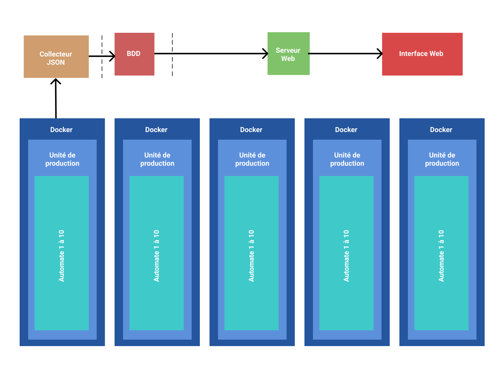

# Projet DevOps 2020 - Au Bon Beurre

Projet réalisé par :

- Killian Cambert : killiancambert
- Antonin Joulie : AntoninJoulie

## Contexte du projet

Notre client a besoin d'un **intranet** afin de visualiser les éléments de suivi de la chaine de traitements des produits.
L'interface Web permet l'accès aux détails des unités, c'est-à-dire les informations liées aux produits, sous la forme de graphiques.
Il est également possible d'exporter ces derniers au format PDF.

## Schéma du projet


## Pré-requis

Installer : 

- docker
- docker-compose

## À savoir

Ce projet est **dockerisé**. l'application est divisée en plusieurs conteneurs :

- Les 5 unités (un conteneur par unité)
- L'API
- La base de données
- L'interface web

## Lancer le projet 

Tout d'abord, il faut se placer das le dossier index avec la commande :

```
cd index
```

Puis effectuer la commande suivante, pour installer toutes les dépendances nécessaires à l'interface web :

```
npm install
```

Ensuite il faut se replacer à la racine du projet et lancer les conteneurs docker avec les commandes suivantes :

```
cd ..
```

```
docker-compose up
```

La commande **docker-compose** peut prendre quelques instants pour construire les conteneurs.

Une fois les conteneurs construits, il sera possible d'accéder à **l'interface web** à cette adresse : [localhost:80](http://localhost:80)

## Lancer le projet en local

Pour lancer les programmes python en local, il va vous falloir 4 invite de commande.

Voici tout d'abord les dépendances nécessaires :

```
python -m pip install mysql-connector-python
```

```
python -m pip install flask
```

```
python -m pip install flask_cors
```

Parcourez les fichiers pour entrer dans le document 'automate' puis lancez la commande suivante :

```
python generation.py
```

Ce programme permet de créer les json à l'aide des 5 unités composé de 10 automates.

Puis dans le même document lancez une seconde invite de commande avec la commande suivante :

```
python envoie.py
```

Ce script permet derécupérer les fichier json et de les saisir dans la base de données.

Lancé dans cet ordre, les deux scripts se lanceront toutes les minutes.

Pour la troisième invite de commande, entrez dans le document 'recup_donnees' et lancez la commande suivante :

```
python script.py
```

Ce programme lancera une interface web : [http://127.0.0.1:5000](http://127.0.0.1:5000/) où on peut retrouver les données de la base.

Le dernier script est dans le document 'recup_donnees' :

```
python python_dump.py
```

Ce programme permet de créer un dump de la base avec les données actuelles.

Ensuite, il faut se placer das le dossier index depuis la racine du projet avec la commande :

```
cd index
```

Puis effectuer la commande suivante, pour installer toutes les dépendances nécessaires à l'interface web :

```
npm install
```

Et enfin, la commande : 

```
npm run serve
```

Une fois cette commande terminée, il est possible d'accéder à **l'interface web** :

[localhost:80](http://localhost:80)


### À savoir

Nous avons créer différents utilisateurs avec différents droits : 

- **root** avec tous les privileges
- **administrateur_delegue** avec tous les privileges sur la base de données `devops`
- **concentrateur_docker** qui possède le GRANT, le SELECT et le UPDATE
- **datavision** qui possède le SELECT

Aussi nous avons mis en place des sockets qui fonctionne dans les conteneurs docker mais malheuresement nous ne n'arrivons pas à connecter la base de données à **MySQL Server**.